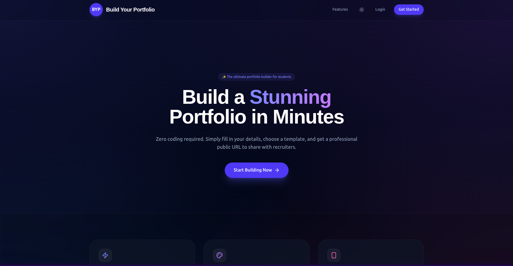
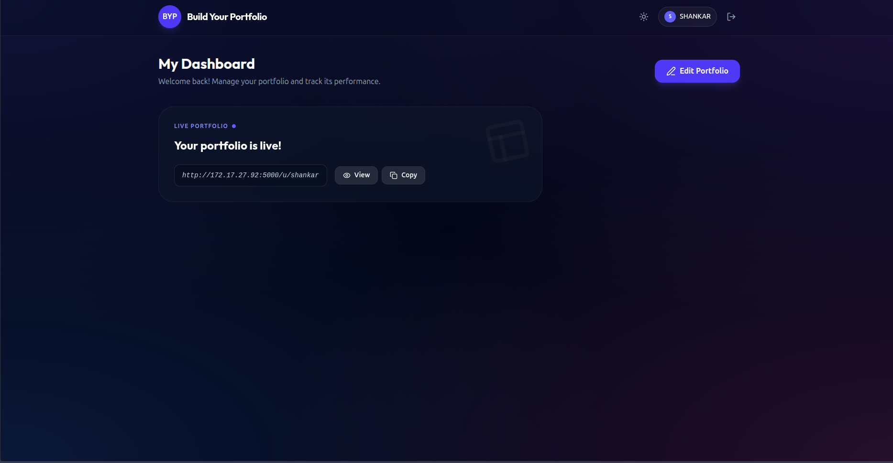
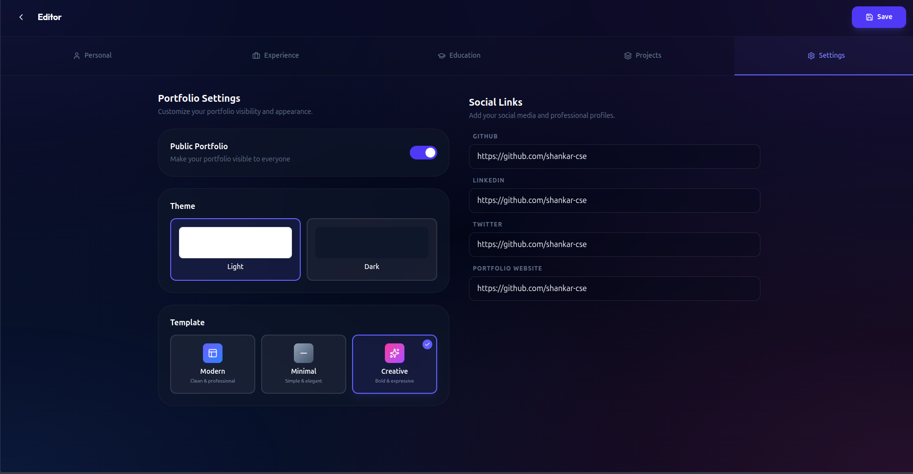
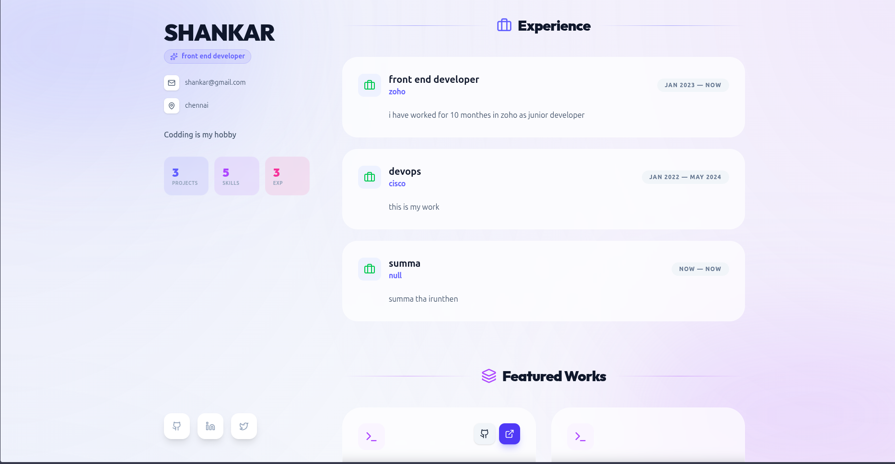
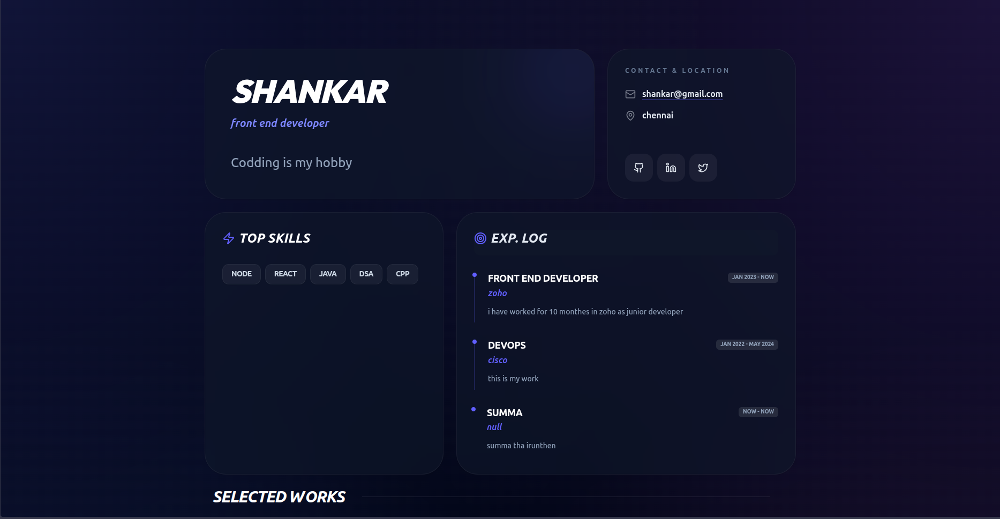
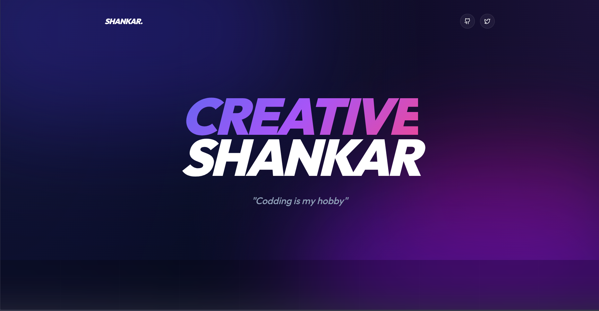

# 🎓 Build Your Portfolio — No-Code Portfolio Builder for Students

A modern, full-stack **MERN** application that enables students to create professional portfolio websites without writing a single line of code. Fill in your details, pick a template, and instantly get a shareable public portfolio URL.

> **Live Demo →** _`https://your-vercel-url.vercel.app`_ _(replace with your deployment URL)_

---

## 📸 Screenshots

### Pages

| Landing Page | Dashboard | Editor |
|:---:|:---:|:---:|
|  |  |  |

### Templates

| Modern | Minimal | Creative |
|:---:|:---:|:---:|
|  |  |  |
| Clean & Professional | Simple & Elegant | Bold & Expressive |

---

## ✨ Features

### 🔐 Authentication
- Email / Password registration and login
- JWT-based authentication (30-day token expiry)
- Modal-based auth UI with backdrop blur and keyboard shortcuts
- Protected routes for Dashboard and Editor
- Persistent sessions via localStorage

### 📝 Portfolio Builder (5-Tab Editor)
| Tab | Contents |
|---|---|
| **Personal** | Name, role, bio, email, location + skills with proficiency levels |
| **Experience** | Work history with company, position, dates, and description |
| **Education** | Degrees, institutions, field of study, and year range |
| **Projects** | Title, description, tech stack tags, GitHub & live links |
| **Settings** | Template selector, theme toggle (light/dark), public/private switch, social links |

### 🎨 Live Editor
- Real-time tabbed editing with Framer Motion transitions
- Full CRUD for every section (add / edit / delete)
- Save with loading state and success toast
- Instant navigation back to Dashboard

### 🌐 Public Portfolio
- Shareable via `/u/username` URL
- Dynamically renders the chosen template (Modern, Minimal, or Creative)
- Responsive across all screen sizes
- Custom 404 state with "Create Yours" CTA

### 📊 Dashboard
- Portfolio status overview
- One-click "Copy Link" with clipboard feedback
- Quick access to Editor (create or edit)
- Loading skeleton with spinner

### 🌙 Theming
- Global dark / light mode toggle (persisted in localStorage)
- Tailwind CSS `dark:` class strategy
- Dark mode by default
- Per-portfolio theme setting (light or dark public page)

---

## 🛠️ Tech Stack

### Frontend
| Technology | Version | Purpose |
|---|---|---|
| **React** | 19 | UI library |
| **Vite** | 7 | Build tool & dev server |
| **Tailwind CSS** | 4 | Utility-first styling |
| **Framer Motion** | 12 | Animations & transitions |
| **React Router** | 7 | Client-side routing (SPA) |
| **React Hook Form** + **Zod** | 7 / 4 | Form handling & validation |
| **Axios** | 1.13 | HTTP client with interceptors |
| **Lucide React** | 0.562 | Icon library |
| **clsx** + **tailwind-merge** | — | Conditional class utilities |

### Backend
| Technology | Version | Purpose |
|---|---|---|
| **Node.js** + **Express** | — / 5 | REST API server |
| **MongoDB** + **Mongoose** | — / 9 | Database & ODM |
| **JWT** (jsonwebtoken) | 9 | Stateless authentication |
| **bcryptjs** | 3 | Password hashing |
| **Cloudinary** + **Multer** | 2 / 2 | Image upload (ready) |

### DevOps & Deployment
| Tool | Purpose |
|---|---|
| **Vercel** | Production hosting (serverless functions + static SPA) |
| **Unified Dev Server** | Single `npm run dev` runs Express + Vite together on port 5173 |
| **Nodemon** | Auto-restart during development |

---

## 🚀 Getting Started

### Prerequisites
- **Node.js** v16+
- **MongoDB** (local install or [MongoDB Atlas](https://www.mongodb.com/atlas))
- **npm**

### Installation

1. **Clone the repository**
   ```bash
   git clone <repository-url>
   cd builder-your-portfolio
   ```

2. **Install all dependencies** (root `postinstall` auto-installs client deps too)
   ```bash
   npm install
   ```

3. **Environment Setup**

   Create a `.env` file inside the **`server/`** directory:
   ```env
   MONGO_URI=mongodb://localhost:27017/portfolio
   JWT_SECRET=your_jwt_secret_key_here
   ```

   _(Optional)_ Create a `.env` file inside the **`client/`** directory for production API URL:
   ```env
   VITE_API_URL=https://your-production-api.com
   ```

4. **Run the application** (single command — starts both API + frontend)
   ```bash
   npm run dev
   ```

   The app will be available at **http://localhost:5173**  
   API routes are served from the same origin under `/api/*`.

---

## 📁 Project Structure

```
builder-your-portfolio/
├── api/
│   └── [[...all]].js          # Vercel serverless adapter
├── dev-server.js               # Unified Express + Vite dev server
├── vercel.json                 # Vercel deployment config
├── package.json                # Root scripts & server dependencies
│
├── client/                     # React frontend (Vite)
│   ├── index.html
│   ├── package.json
│   ├── vite.config.js
│   └── src/
│       ├── App.jsx             # Routes & layout
│       ├── main.jsx            # Entry point
│       ├── index.css           # Global styles & Tailwind
│       ├── api/
│       │   ├── axiosConfig.js  # Axios instance + auth interceptor
│       │   └── portfolioService.js
│       ├── components/
│       │   ├── Navbar.jsx      # Shared navigation bar
│       │   ├── ProtectedRoute.jsx
│       │   ├── editor/         # Form components per tab
│       │   │   ├── PersonalInfoForm.jsx
│       │   │   ├── ExperienceForm.jsx
│       │   │   ├── EducationForm.jsx
│       │   │   ├── ProjectsForm.jsx
│       │   │   ├── SkillsForm.jsx
│       │   │   └── SettingsForm.jsx
│       │   └── templates/      # Portfolio render templates
│       │       ├── ModernTemplate.jsx
│       │       ├── MinimalTemplate.jsx
│       │       └── CreativeTemplate.jsx
│       ├── context/
│       │   ├── AuthContext.jsx  # Auth state, login, register, logout
│       │   └── ThemeContext.jsx # Dark/light mode toggle
│       └── pages/
│           ├── LandingPage.jsx
│           ├── Login.jsx       # Modal overlay
│           ├── Register.jsx    # Modal overlay
│           ├── Dashboard.jsx
│           ├── Editor.jsx
│           └── PublicPortfolio.jsx
│
└── server/                     # Express API
    ├── app.js                  # Express app setup & middleware
    ├── index.js                # Standalone server entry
    ├── config/
    │   └── db.js               # MongoDB connection
    ├── middleware/
    │   └── authMiddleware.js   # JWT verification
    ├── models/
    │   ├── User.js             # User schema (bcrypt pre-save hook)
    │   └── Portfolio.js        # Portfolio schema (all sections)
    └── routes/
        ├── auth.js             # POST /register, /login
        └── portfolio.js        # GET /me, POST /, GET /public/:username
```

---

## 🔑 API Endpoints

### Authentication
| Method | Endpoint | Access | Description |
|---|---|---|---|
| `POST` | `/api/auth/register` | Public | Create account (validates unique email & username) |
| `POST` | `/api/auth/login` | Public | Login with email & password, returns JWT |

### Portfolio
| Method | Endpoint | Access | Description |
|---|---|---|---|
| `GET` | `/api/portfolio/me` | Private | Get authenticated user's portfolio |
| `POST` | `/api/portfolio` | Private | Create or update portfolio (upsert) |
| `GET` | `/api/portfolio/public/:username` | Public | Get a user's public portfolio |

---

## 🎯 Usage Guide

1. **Register** — Click "Get Started" on the landing page to create an account
2. **Login** — Sign in with your email and password
3. **Dashboard** — View your portfolio status and shareable link
4. **Editor** — Click "Edit Portfolio" (or "Create Portfolio") and fill out:
   - **Personal** — Name, role, bio, email, location, and skills
   - **Experience** — Add your work history
   - **Education** — Add degrees and certifications
   - **Projects** — Showcase your work with tech stacks and links
   - **Settings** — Choose a template, set theme, toggle privacy, add social links
5. **Save** — Hit the Save button (top right) to persist all changes
6. **Share** — Copy your public URL from the Dashboard
7. **View** — Visit `/u/yourusername` to see your live portfolio

---

## 🔮 Roadmap

- [ ] Image upload integration with Cloudinary
- [ ] QR code generation for portfolio URL
- [ ] PDF resume export
- [ ] Analytics dashboard (views, clicks, visitors)
- [ ] AI-powered content suggestions
- [ ] Custom domain support
- [ ] Certifications & achievements sections
- [ ] More portfolio templates
- [ ] Email verification
- [ ] Password reset functionality

## � Documentation

See [DOCUMENTATION.md](DOCUMENTATION.md) for full technical documentation including:
- Architecture overview & data flow diagrams
- Frontend routing, context providers, and API layer
- Backend models, routes, and authentication
- Deployment configuration (Vercel)
- Security considerations

## 🤝 Contributing

Contributions, issues, and feature requests are welcome! See [CONTRIBUTING.md](CONTRIBUTING.md) for:
- Development setup guide
- Branching & commit conventions
- Step-by-step guides for adding templates, editor tabs, and API endpoints
- PR checklist and submission process
- Good first issues and roadmap

## 📄 License

This project is open source and available for educational purposes.

## 👨‍💻 Author

Built with ❤️ for students by students

---

**Made with build your portfolio** ✨